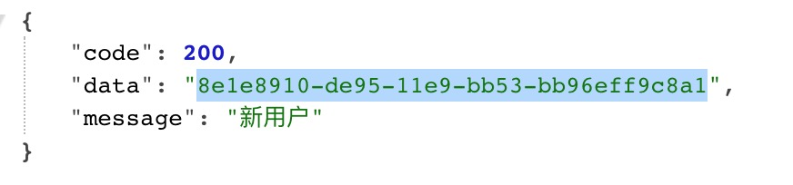
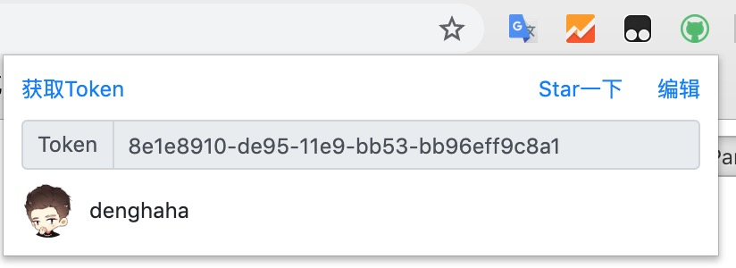
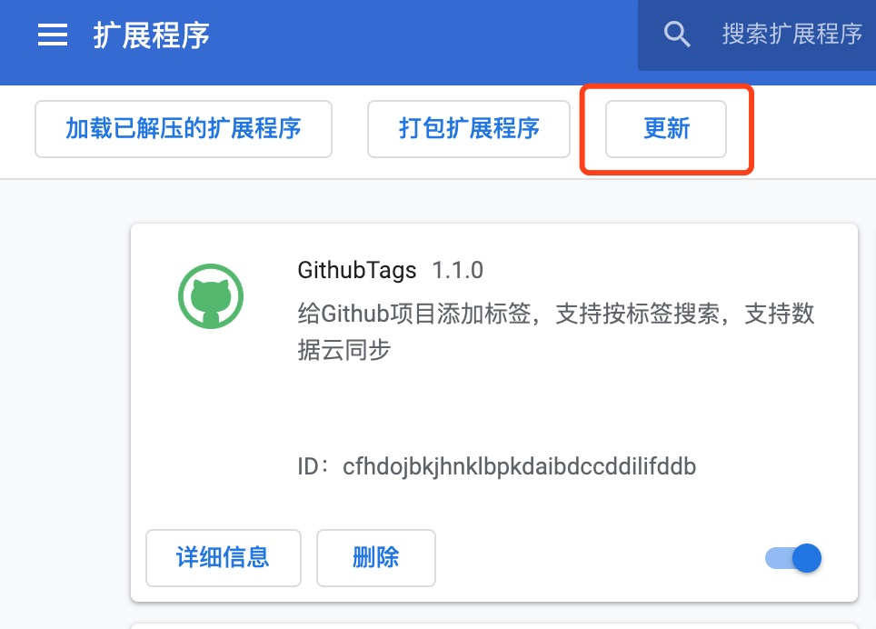

[停止更新，正常维护]

# GithubTags

给 Github 项目添加标签的 Chrome 插件，支持按标签搜索，数据支持云同步

## 安装

[从 Chrome 插件商店安装](https://chrome.google.com/webstore/detail/jfppflnlpiekbiglfgiajddmkiglapog)

[下载 crx 文件安装](https://github.com/dengyuhan/github-tags/releases)

## 截图

#### 项目详情

#### 个人主页

## 云同步

> 由于旧版使用的云现在需要实名认证才能用，所以目前已更换至私有云

[授权 Github](https://gt.xiandan.in/oauth)获取到 Token

将其填入插件保存，如果正常显示头像，表示可以正常使用

## 更新说明

地址栏输入`chrome://extensions`进入到扩展程序页面，点“更新”即可

