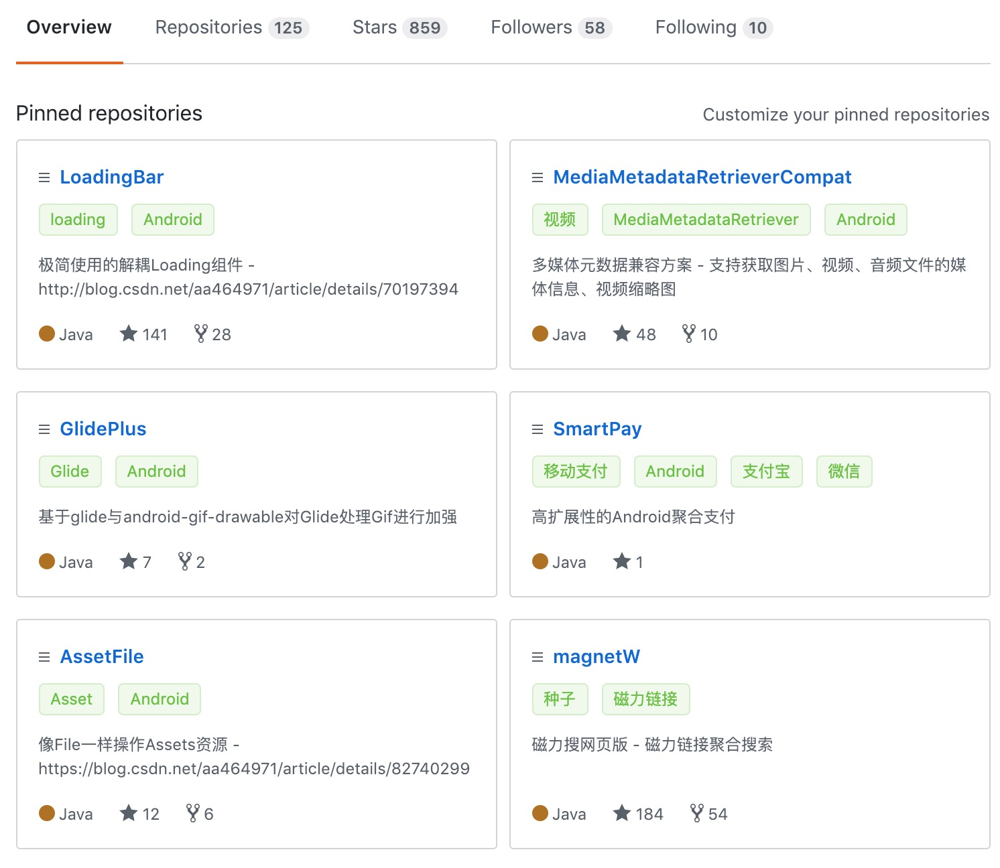
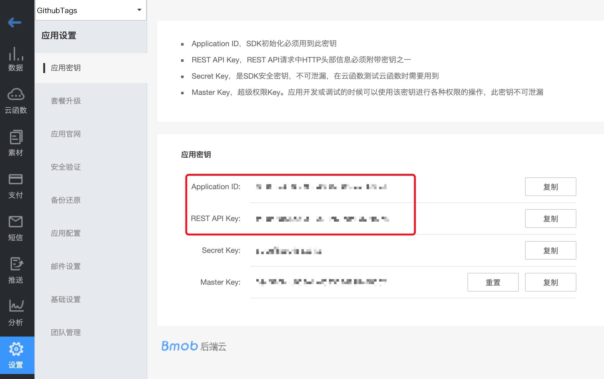
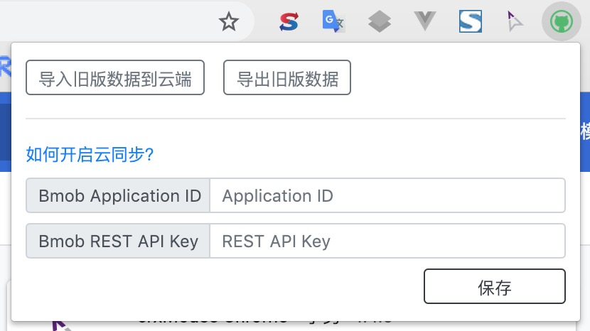
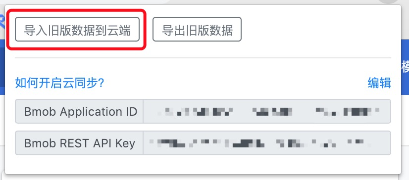
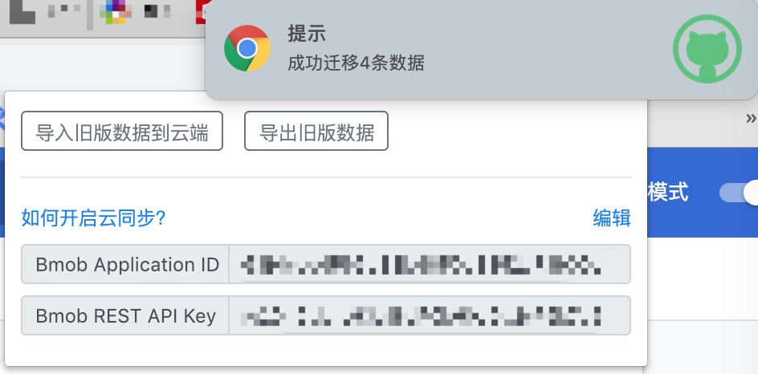
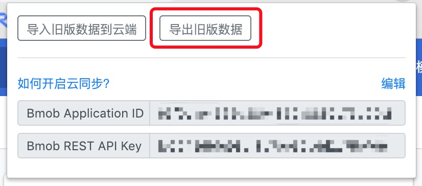

# GithubTags
给Github项目添加标签的Chrome插件，支持按标签搜索，数据支持云同步

[从Chrome插件商店安装](https://chrome.google.com/webstore/detail/jfppflnlpiekbiglfgiajddmkiglapog)

#### 项目详情

#### 个人主页

## 云同步
数据存储用的是[比目云](https://www.bmob.cn/app/list)，但只会用到它的免费服务，所以需要先到网站注册账号并创建一个应用，再进入到设置就会看到`Application ID`和`REST API Key`

复制到插件中保存刷新页面就可以实现云同步了

### 旧版数据迁移到云
1.先填入`Application ID`和`REST API Key`并保存；  
2.如果已有Json文件备份，直接点击`导入旧版数据到云端`，看到成功的提示后，可以在比目云的管理后台，查看一下有没有数据；

3.如果没有备份旧版的Json文件，点击`导出旧版数据`，得到Json文件后操作第2步。

##### 因为用的是免费版，所以会有比较多的限制，如果有更好的云同步方案请提[issue](https://github.com/dengyuhan/github-tags/issues/new)告诉我

##### 想继续使用本地数据版的可以安装旧版[1.0.6](https://github.com/dengyuhan/github-tags/releases/tag/1.0.6)

##### *如果迁移失败，不要卸载插件，不要清除数据，先导出Json文件备份，提[issue](https://github.com/dengyuhan/github-tags/issues/new)告诉我

### 参考项目
[Git-Remarks](https://github.com/hoythan/Git-Remarks)
